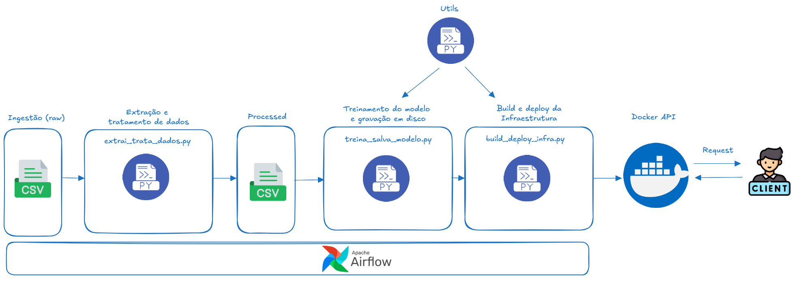

## Case técnico para grupo Oboticário

### Objetivo

1. Desenvolvimento de um modelo de previsões sobre os preços de imóveis a partir de suas características.
2. Implementação do modelo atavés de um pipeline de treinamento automatizado e disponibilização por web service (API)

### Playbook

Este case foi desenvolvido com ferramentas open source e localmente. Portanto é necessário a instalação local dessas
ferramentas para executá-lo. Segue abaixo os passos necessários para ambiente linux:

1. Instalação Airflow localmente:<br>
    No terminal digite:<br>
        <i>pip install apache-airflow</i><br>
    Após a instalação, executar em 2 janelas do terminal:<br>
        <i>airflow webserver --port 8080</i><br>
        <i>airflow scheduler</i><br>
    Obs: essas janelas devem ficar em execução

2. Instalação Docker Desktop<br>
    No terminal digite:<br>
        Para ubuntu: <i>sudo apt-get install ./docker-desktop-amd64.deb</i><br>
        Caso use outro sistema operacional, obtenha mais informações aqui: [aqui](https://www.docker.com/products/docker-desktop/)<br>
    Obs: O Docker desktop deve estar em execução

3. Crie um ambiente virtual e ative-o:<br>
    No terminal digite:<br>

        <i>python -m venv nome_do_ambiente</i><br>

        ou, caso esteja usando python3<br>

        <i>python3 -m venv nome_do_ambiente</i><br>

        Ative-o usando o seguinte comando:<br>

        <i>source nome_do_ambiente/bin/activate</i><br>

4. Instale as dependências:<br>
    No terminal digite:<br>
        <i>pip install -r requirements.txt</i>

5. Configurando o airflow:<br>
    5.1 criando um novo usuario admin:<br>
        No terminal digite:<br>
            airflow users create \
            --username admin \
            --firstname Peter \
            --lastname Parker \
            --role Admin \
            --email spiderman@superhero.org<br>
        obs: coloque seus dados
    5.2 Acessando airflow:<br>
        No navegador digite:<br>
        <i>http://localhost:8080/</i><br>
        Faça o login com o usuario criado
    
    5.3 Configurando as dags e plugins<br>
        Adicione as dags do projeto dentro do diretório dags onde o airflow foi instalado<br> 
        e o diretório plugins na raíz da instalação<br>
    Obs: caso nao exista os diretórios, crie-os

    5.4 Configurando paths<br>
        Em variáveis no airflow adicione os seguintes caminhos:<br>
        PROCESSED_DATA_PATH = /caminho_para_o_csv_processado<br>
        ARTEFATOS_PATH = /caminho_para_os_artefatos<br>
        METADADOS_PATH = /caminho_para_os_metadados<br>
        RAW_DATA_PATH = /caminho_para_o_csv_sem_tratamento
    
    6. Instalação mlflow<br>
        No terminal, digite:<br>

        <i>pip install mlflow</i><br>

        Em seguida, deixe em execução o terminal com o seguinte comando:<br>

        <i>mlflow ui --port 5000</i>

    7. Configure o arquivo utils.py<br>
        Dentro do diretório plugins, abra o arquivo utils.py e altere a variavel <i>LOCAL_ARTEFATOS</i><br>
        e coloque o caminho local dos artefatos


### Estrutura de diretórios

```
└── 📁case-boticario
    └── 📁app
        └── main.py
        └── modelo.py
    └── 📁artefatos
        └── 📁metadados
            └── metadados_v1.json
            └── metadados_v2.json
            └── metadados_v3.json
            └── metadados_v4.json
            └── metadados_v5.json
            └── metadados_v6.json
            └── metadados_v7.json
            └── metadados_v8.json
            └── metadados_v9.json
        └── 📁modelo
            └── modelo_v1.pkl
            └── modelo_v2.pkl
            └── modelo_v3.pkl
            └── modelo_v4.pkl
            └── modelo_v5.pkl
            └── modelo_v6.pkl
            └── modelo_v7.pkl
            └── modelo_v8.pkl
            └── modelo_v9.pkl
        └── 📁scaler
            └── scaler_v1.pkl
            └── scaler_v2.pkl
            └── scaler_v3.pkl
            └── scaler_v4.pkl
            └── scaler_v5.pkl
            └── scaler_v6.pkl
            └── scaler_v7.pkl
            └── scaler_v8.pkl
            └── scaler_v9.pkl
    └── 📁dados
        └── 📁processed
            └── HousePrices_HalfMil_processed.csv
        └── 📁raw
            └── HousePrices_HalfMil.csv
    └── 📁dags
        └── build_deploy_infra.py
        └── extrai_trata_dados.py
        └── treina_salva_modelo.py
    └── Docs
        └── arquitetura_case_boticario.png
    └── 📁notebooks
        └── model.ipynb
    └── 📁plugins
        └── __init__.py
        └── 📁__pycache__
            └── __init__.cpython-311.pyc
            └── utils.cpython-311.pyc
        └── utils.py
    └── .gitignore
    └── cliente.py
    └── docker-compose.yml
    └── Dockerfile
    └── README.md
    └── requirements.txt
```
### Arquivos e diretórios

1. app: diretório onde estão os arquivos de configuração da API<br>
2. artefatos: diretório onde estão os artefatos gerados no treinamento do modelo<br>
3. dados: diretório onde estão os arquivos CSV raw e processado<br>
4. dags: diretório onde se encontram as dags de treinamento e deploy do modelo<br>
    4.1 build_deploy_infra.py: Cria imagem e contâiner docker para a API<br>
    4.2 extrai_trata_dados.py: Extrai os dados brutos do csv em /dados/raw, <br>
    trata os dados e salva em /dados/processed<br>
    4.3 treina_salva_modelo.py Treina modelo, checa métricas e salva em disco em /artefatos<br>
5. docs: arquivos de documentação <br>
6. notebooks: notebook com análise, exploração de dados e experimentação do modelo<br>
7. plugins: arquivos de configuração e suporte as dags<br>
    7.1: utils.py: arquivo contem funções de suporte para dag de treinamento e de carragamento do modelo no cont&ainer
8. cliente.py: arquivo que realiza requests a API<br>
9. docker-compose.yml: configuração de imagem e contâiners<br>
10. Dockerfile: configuração de arquivos e comportamento do contâiner<br>
11. requirements.txt: bibliotecas de dependências 

### Arquitetura



### Tecnologias usadas

1. python<br>
2. bash Script<br>
3. airflow<br>
4. docker<br>
5. mlflow<br>
6. linux<br>


### Conclusão e próximos passos

O projeto atende a necessidade de disponibilizar um modelo de machine learning através de um pipeline de dados.<br>
Utiliza de tecnologias e processos simplificados, de fácil compreensão e eficaz para o volume de dados.<br>
Em caso de maior volumetria, alguns processos poderiam ser melhorados como:<br>
- Utilizar serviços em nuvem como Composer para Airflow, storage para armazenamento dos arquivos, um<br>
cluster Dataproc com pyspark para ingestão e processamento de dados ou até mesmo usar Cloud functions com
triggers de mensageria do Pub/sub<br>
- Os dados poderiam ser armazenados em banco de dados e poderíamos usar scripts em SQL para ingestão,<br>
utilizando ferramentas como pyspark.sql<br>
- A infraestrutura poderia estar em IaC(terraform) para um melhor controle e automação dos recursos


